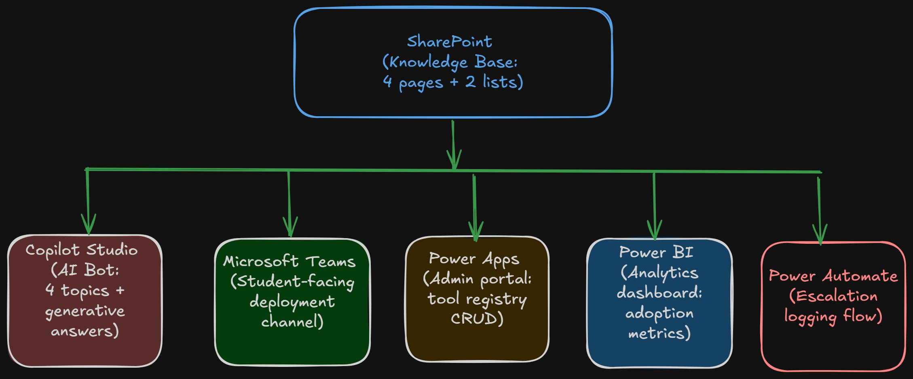

# CampusAI Navigator — MVP Implementation Guide

> **Microsoft Faculty AI Skilling Initiative | Cohort 4 | Group 13**
> Institutional AI Enablement Track

An AI-powered student onboarding assistant built entirely on Microsoft 365 — no external tools, no new infrastructure, no procurement.

---

## Table of Contents

1. [Architecture Overview](#architecture-overview)
2. [Phase 1 — SharePoint Knowledge Base](#phase-1--sharepoint-knowledge-base)
3. [Phase 2 — Copilot Studio Bot](#phase-2--copilot-studio-bot)
4. [Phase 3 — Microsoft Teams Deployment](#phase-3--microsoft-teams-deployment)
5. [Phase 4 — Power Apps Admin Portal](#phase-4--power-apps-admin-portal)
6. [Phase 5 — Power Automate Query Logging](#phase-5--power-automate-query-logging)
7. [Phase 6 — Power BI Analytics Dashboard](#phase-6--power-bi-analytics-dashboard)
8. [Challenges & Workarounds](#challenges--workarounds)
9. [Demo Day Script](#demo-day-script)

---

## Architecture Overview



| Component | Tool | Purpose |
|---|---|---|
| Knowledge Base | SharePoint | 4 pages + AI Tools Registry + Bot Query Log |
| AI Chatbot | Copilot Studio | Answers student queries via generative AI |
| Student Interface | Microsoft Teams | Zero-friction deployment channel |
| Admin Portal | Power Apps | Manage approved tools without touching SharePoint |
| Analytics | Power BI | Track adoption trends and escalation rates |
| Query Logging | Power Automate | Auto-logs escalations to SharePoint list |

**Total build time:** ~4–5 hours. Runs inside any existing Microsoft 365 tenant.

---

## Phase 1 — SharePoint Knowledge Base

**Estimated time: ~45 minutes**

### Step 1.1 — Create the SharePoint Site

1. Go to [sharepoint.com](https://sharepoint.com) and sign in with your Microsoft 365 account
2. Click **+ Create site** → **Team site**
3. Site name: `CampusAI Navigator`
4. Description: `Institutional AI onboarding knowledge base for students`
5. Privacy: **Private**
6. Click **Next** → **Finish**

---

### Step 1.2 — Create the Four Knowledge Pages

From your site: **Pages** → **New** → **Page** → **Blank** → enter the title → paste the content → **Publish**

---

#### Page 1: Approved AI Tools

**Title to enter in SharePoint:**
```
Approved AI Tools for Students
```

**Body content:**

```
This page lists AI tools students are permitted to use for academic work.
Each tool includes approved use cases and restrictions.

─────────────────────────────────────────────
MICROSOFT COPILOT
Status: Fully Approved
What it is: Microsoft's AI assistant built into your M365 apps — Word,
  Teams, OneNote, and Outlook.
Approved for: Drafting and editing written work, summarising research,
  generating study notes, brainstorming, creating presentation outlines.
How to access: Open any M365 app and click the Copilot (sparkle) icon,
  or go to copilot.microsoft.com and sign in with your institution email.
Restrictions: Do not submit Copilot output as your own without disclosure.
  Always verify facts before including them in academic submissions.

─────────────────────────────────────────────
CHATGPT (OpenAI)
Status: Conditionally Approved
What it is: General-purpose AI chatbot for text generation, Q&A,
  summarisation, and code support.
Approved for: Research ideation, concept explanation, code debugging,
  essay outlining, language translation support.
How to access: chatgpt.com — free tier available.
Restrictions: Must be disclosed in all submissions. Do not paste full
  assignment questions and submit the output. Not approved for invigilated
  assessments. Content must be reviewed, verified, and substantially
  rewritten by the student.

─────────────────────────────────────────────
GRAMMARLY
Status: Fully Approved
What it is: AI writing assistant for grammar, spelling, tone, and clarity.
Approved for: Proofreading and editing all written academic work.
How to access: grammarly.com — browser extension recommended.
Restrictions: The Rewrite and Paraphrase features must not replace your
  original writing. Use for editing, not generation.

─────────────────────────────────────────────
GITHUB COPILOT
Status: Approved for CS and Engineering students only
What it is: AI code completion tool integrated into VS Code and other IDEs.
Approved for: Code completion, debugging assistance, syntax explanation.
How to access: github.com/copilot — free for students via GitHub Education.
Restrictions: Disclose use in programming assignments. Do not use to
  complete entire functions without understanding the code.
  Not permitted in practical examinations.

─────────────────────────────────────────────
PERPLEXITY AI
Status: Conditionally Approved
What it is: AI-powered search engine that answers questions with sources.
Approved for: Literature discovery, quick fact-checking, research starts.
How to access: perplexity.ai — free tier available.
Restrictions: Always verify cited sources independently. Do not treat
  Perplexity answers as primary academic sources.

─────────────────────────────────────────────
Need help choosing a tool? Ask CampusAI Navigator in Microsoft Teams.
```

---

#### Page 2: Academic Integrity Policy on AI Use

**Title:**
```
Academic Integrity Policy: AI Use Guidelines
```

**Body content:**

```
This policy governs how students may use AI tools in academic work.
It applies to all programmes, all levels, and all modes of study.

─────────────────────────────────────────────
WHAT COUNTS AS AI-ASSISTED WORK
Any work partially or wholly generated, rewritten, summarised, or completed
with the assistance of an AI tool is considered AI-assisted. This includes
text, code, images, data analysis, and translations.

─────────────────────────────────────────────
WHAT IS PERMITTED
- Using approved AI tools for ideation, outlining, editing, and research support
- Using AI to understand concepts or generate personal study materials
- Using AI for code debugging where explicitly permitted by your lecturer
- Using AI-powered grammar and spelling checkers for all written work

─────────────────────────────────────────────
WHAT IS NOT PERMITTED
- Submitting AI-generated content as your own without disclosure
- Using AI tools during invigilated examinations or timed tests
- Using AI to complete assessments entirely on your behalf
- Sharing full assessment questions with public AI tools

─────────────────────────────────────────────
DISCLOSURE REQUIREMENTS
Where AI was used in any submission, include this statement at the end:

  AI Disclosure: [Tool name] was used to [describe use, e.g. generate an
  initial outline / check grammar / explain a concept]. All content was
  reviewed, verified, and substantially modified by the author.

─────────────────────────────────────────────
ACADEMIC CONSEQUENCES
Undisclosed or unapproved AI use in academic submissions constitutes
academic dishonesty and may result in:
- A mark of zero for the assessment
- Academic probation
- Disciplinary proceedings as per the institution academic integrity policy

─────────────────────────────────────────────
Questions? Contact your Student Affairs office or ask CampusAI Navigator.
```

---

#### Page 3: How to Use Microsoft Copilot

**Title:**
```
Getting Started with Microsoft Copilot
```

**Body content:**

```
Microsoft Copilot is your AI assistant built into your M365 account.
This guide walks you through accessing and using it for your studies.

─────────────────────────────────────────────
STEP 1 — ACCESS COPILOT
Option A (Web): Go to copilot.microsoft.com, sign in with your institution
  Microsoft 365 email.
Option B (Inside M365 apps): Open Word, OneNote, or Teams. Look for the
  sparkle icon (✨) in the toolbar or sidebar.
Option C (Inside Teams): Click the Copilot icon in the left sidebar.

─────────────────────────────────────────────
STEP 2 — YOUR FIRST CONVERSATION
Type your request in plain English in the chat input at the bottom.
Example: Explain the concept of supply and demand in simple terms.
Copilot will respond. You can ask follow-up questions to refine the answer.

─────────────────────────────────────────────
STEP 3 — PRACTICAL USES FOR STUDENTS

Summarising long readings:
  Summarise the key arguments in this text: [paste text]

Brainstorming essay ideas:
  Give me 5 angles I could argue for an essay on climate change policy.

Explaining difficult concepts:
  Explain machine learning to me like I am a first-year student.

Building a study plan:
  Create a 2-week revision plan for a 4-topic exam on business strategy.

Drafting professional emails:
  Help me write a professional email to my lecturer requesting an extension.

─────────────────────────────────────────────
STEP 4 — ALWAYS REVIEW THE OUTPUT
Copilot can produce inaccurate information.
Before using output in academic work:
- Verify facts independently
- Rewrite in your own voice
- Add your AI Use Disclosure Statement

─────────────────────────────────────────────
Need more help? Ask CampusAI Navigator in Teams.
```

---

#### Page 4: Prompt Engineering Basics

**Title:**
```
Prompt Engineering: Getting Better Answers from AI
```

**Body content:**

```
A prompt is the instruction you give an AI tool. A well-structured prompt
gets you a useful response. A vague prompt gets you a vague answer.

─────────────────────────────────────────────
THE ANATOMY OF A GOOD PROMPT
1. Role    — Tell the AI who it is: Act as a university tutor
2. Task    — Tell it what to do: Explain the concept of...
3. Context — Give relevant info: I am a first-year Business student
4. Format  — Tell it how to respond: In bullet points, under 200 words

─────────────────────────────────────────────
5 PROMPT TEMPLATES YOU CAN COPY

TEMPLATE 1 — Concept Explanation:
  Act as a university lecturer. Explain [concept] to a first-year [subject]
  student. Use simple language, one real-world example, and keep it under
  150 words.

TEMPLATE 2 — Essay Outline:
  I am writing a [word count]-word essay on [topic] for a [course] course.
  Generate a structured outline with 3 main arguments and supporting points.

TEMPLATE 3 — Study Notes:
  Convert the following text into concise revision notes with headings and
  bullet points. Highlight the 3 most important ideas. [Paste text here]

TEMPLATE 4 — Code Explanation (CS students):
  Explain what this code does line by line in plain English. Identify any
  potential bugs. [Paste code here]

TEMPLATE 5 — Practice Questions:
  Generate 5 exam-style questions on [topic] for a [level] [subject]
  student. Include the expected answer for each question.

─────────────────────────────────────────────
COMMON MISTAKES TO AVOID
Too vague: Tell me about marketing
Better:    Explain the 4Ps of marketing with a retail industry example.

Too much at once: Break complex tasks into smaller follow-up prompts.

Accepting the first answer: Always ask for a revision or follow-up.

─────────────────────────────────────────────
Practice: Open Microsoft Copilot in Teams and try Template 1 with a topic
from your current coursework.
```

---

### Step 1.3 — Create the AI Tools Registry List

1. **Site contents** → **New** → **List**
2. Name: `AI Tools Registry` → **Create**
3. Rename the default **Title** column to `Tool Name`
4. Add the following columns (**+ Add column** for each):

| Column Name | Column Type |
|---|---|
| Category | Single line of text |
| Approved For | Multiple lines of text |
| Restrictions | Multiple lines of text |
| Resource Link | Hyperlink |

5. Add these 5 rows (click **+ New** for each):

**Row 1 — Microsoft Copilot**

| Field | Value |
|---|---|
| Tool Name | Microsoft Copilot |
| Category | Productivity & Writing |
| Approved For | All students — drafting, editing, summarising, brainstorming |
| Restrictions | Disclosure required. Verify all facts. Do not submit output without review. |
| Resource Link | https://copilot.microsoft.com |

**Row 2 — ChatGPT**

| Field | Value |
|---|---|
| Tool Name | ChatGPT |
| Category | General AI Assistant |
| Approved For | Research ideation, concept explanation, outlining, code debugging |
| Restrictions | Disclosure required. Not for invigilated assessments. Must be rewritten by student. |
| Resource Link | https://chatgpt.com |

**Row 3 — Grammarly**

| Field | Value |
|---|---|
| Tool Name | Grammarly |
| Category | Writing Assistant |
| Approved For | All students — proofreading and grammar checking |
| Restrictions | Rewrite and Paraphrase features must not replace original writing. |
| Resource Link | https://grammarly.com |

**Row 4 — GitHub Copilot**

| Field | Value |
|---|---|
| Tool Name | GitHub Copilot |
| Category | Coding Assistant |
| Approved For | CS and Engineering students — code completion and debugging |
| Restrictions | Disclose in assignments. Not permitted in practical exams. |
| Resource Link | https://github.com/copilot |

**Row 5 — Perplexity AI**

| Field | Value |
|---|---|
| Tool Name | Perplexity AI |
| Category | AI Search |
| Approved For | Research starting points and fact-checking |
| Restrictions | Verify all cited sources independently. Not a primary academic source. |
| Resource Link | https://perplexity.ai |

---

### Step 1.4 — Create the Bot Query Log List

1. **Site contents** → **New** → **List** → Name: `Bot Query Log` → **Create**
2. Rename the default **Title** column to `Query Topic`
3. Add these columns:

| Column Name | Column Type |
|---|---|
| Date | Date and time |
| Resolved | Yes/No |
| Escalated | Yes/No |

4. Add 10 sample rows manually using today's date, topics from the 4 pages, and a mix of Yes/No values to populate the Power BI dashboard for the demo.

> **Sample topics:** Approved Tools, ChatGPT Policy, Copilot Access, Prompt Help, Academic Integrity, Disclosure Format, GitHub Copilot, Grammarly Use, Study Notes, Contact Request.

---

## Phase 2 — Copilot Studio Bot

**Estimated time: ~60 minutes**

### Step 2.1 — Create the Agent

1. Go to [copilotstudio.microsoft.com](https://copilotstudio.microsoft.com) and sign in
2. Click **+ New agent** → **Skip to configure**
3. Enter these details:

```
Name:         CampusAI Navigator

Description:  Helps university students find approved AI tools, understand
              academic integrity policies, and build practical AI literacy.

Instructions: You are CampusAI Navigator, an AI onboarding assistant for
              university students. Answer questions about approved AI tools,
              academic integrity policies, Microsoft Copilot usage, and prompt
              engineering. Keep responses clear, friendly, and under 200 words.
              When you cannot answer, offer to escalate to Student Affairs.
```

4. Click **Create**

---

### Step 2.2 — Connect SharePoint as Knowledge Source

1. Click the **Knowledge** tab → **+ Add knowledge** → **SharePoint**
2. Paste your SharePoint site URL
3. Select all 4 pages → **Add**
4. Go to **Settings** → **Generative AI** → turn on **Generative answers** → **Save**

> This single step enables the bot to answer almost any student question from your SharePoint content without manually scripting every topic.

---

### Step 2.3 — Create the 4 Manual Topics

Go to **Topics** → **+ New topic** → **From blank** for each topic below.

---

#### Topic 1: Greeting

**Trigger phrases:**
```
hi
hello
hey
good morning
good afternoon
get started
what can you do
help me
start
```

**Message node:**
```
Hi! I'm CampusAI Navigator, your guide to AI tools and policies.

Here is what I can help you with:
- Find out which AI tools are approved for your coursework
- Understand the academic integrity policy on AI use
- Learn how to use Microsoft Copilot effectively
- Get started with prompt engineering

What would you like to know?
```

Save as: `Greeting`

---

#### Topic 2: Tool Lookup

**Trigger phrases:**
```
what AI tools can I use
approved tools
which tools are allowed
can I use ChatGPT
can I use AI for assignments
what tools does the institution approve
AI tools for students
which AI is approved
```

**Message node:**
```
Your institution has approved several AI tools for student use:

APPROVED:
- Microsoft Copilot — fully approved for all students (your M365 account)
- Grammarly — fully approved for writing and proofreading

CONDITIONALLY APPROVED (disclosure required):
- ChatGPT — for research, outlining, and concept explanation
  Not for invigilated assessments. Must disclose use.
- Perplexity AI — for research starting points. Verify all sources.

CS AND ENGINEERING STUDENTS ONLY:
- GitHub Copilot — code completion and debugging

For full restrictions, visit the Approved AI Tools page or ask me about
a specific tool by name.
```

Save as: `Tool Lookup`

---

#### Topic 3: Policy Check

**Trigger phrases:**
```
is it allowed
academic integrity
can I submit AI work
AI policy
will I get in trouble
what are the rules on AI
do I need to disclose
how do I cite AI
AI in assignments
```

**Message node:**
```
Here is the short version of the AI academic integrity policy:

ALLOWED:
- Using AI for ideation, outlining, editing, summarising — with disclosure
- AI-powered grammar and spell checking

NOT ALLOWED:
- Submitting AI-generated content as your own without disclosure
- Using AI during invigilated exams or timed tests

DISCLOSURE STATEMENT — add this to the end of any AI-assisted submission:

  AI Disclosure: [Tool] was used to [describe use]. All content was
  reviewed and substantially modified by the author.

Undisclosed AI use is treated as academic dishonesty.

Want the full policy? I can pull it up for you.
```

Save as: `Policy Check`

---

#### Topic 4: Escalate to Team

> **Note:** Copilot Studio has a reserved system topic named `Escalate`. Custom topics cannot share that exact name. This topic is named `Escalate to Team` — same functionality, no conflict.

**Trigger phrases:**
```
talk to someone
contact
need human help
speak to a person
student affairs
not answered
my question is not covered
I need more help
escalate
```

**Message node:**
```
I am not able to help with that one — let me connect you to someone who can.

Student Affairs:           studentaffairs@yourinstitution.ac
Academic Integrity Office:  integrity@yourinstitution.ac
IT Support (M365 issues):   itsupport@yourinstitution.ac

You can also visit the Student Services portal on your institution website.

Is there anything else I can help you with?
```

Save as: `Escalate to Team`

> Update the email addresses with your actual institution contacts before demo day.

---

### Step 2.4 — Test the Bot

Click **Test** (top right) and run these 5 queries:

| Test Query | Expected Behaviour |
|---|---|
| What AI tools can I use? | Tool Lookup topic fires |
| Is ChatGPT allowed for my essay? | Generative answer from SharePoint policy page |
| How do I use Microsoft Copilot? | Generative answer from Copilot guide page |
| What is a good prompt? | Generative answer from Prompt Engineering page |
| I need to talk to someone | Escalate to Team topic fires — shows contact details |

> If a generative answer is wrong or incomplete, go back to the SharePoint page and add more detail to that section.

---

## Phase 3 — Microsoft Teams Deployment

**Estimated time: ~15 minutes**

> **Known Issue:** Publishing the Copilot Studio agent to Microsoft Teams may be blocked by licensing tier constraints in your institutional M365 environment. See [Challenges & Workarounds](#challenges--workarounds).

### Step 3.1 — Publish the Bot

1. In Copilot Studio → **Publish** → **Publish now**
2. Wait for the green confirmation message

### Step 3.2 — Connect to Teams

1. Click **Channels** → **Microsoft Teams** → **Turn on**
2. Click **Open bot in Teams** to launch the bot in your personal Teams chat
3. Test: type `What AI tools can I use?` — confirm the bot replies

### Step 3.3 — Add to a Team Channel

1. In Teams → target channel → **+** (Add a tab) → search for your bot
2. Select **CampusAI Navigator** → **Add**

> Create a test channel called `CampusAI Demo` for a clean presentation environment.

---

## Phase 4 — Power Apps Admin Portal

**Estimated time: ~50 minutes**

### Step 4.1 — Create the Canvas App

1. Go to [make.powerapps.com](https://make.powerapps.com)
2. **+ Create** → **Canvas app from blank**
3. App name: `CampusAI Tool Registry`
4. Format: **Tablet** → **Create**

### Step 4.2 — Connect to SharePoint

1. Click **Data** (cylinder icon) → **+ Add data** → **SharePoint**
2. Connect to your SharePoint site URL
3. Select **AI Tools Registry** → **Connect**

### Step 4.3 — Screen 1: Tool List

**Header rectangle:**
```
Fill: RGBA(0, 120, 212, 1)
X: 0  |  Y: 0  |  Width: Parent.Width  |  Height: 80
```

**Title label:**
```
Text: "CampusAI Navigator — Tool Registry"
X: 20  |  Y: 20
Color: RGBA(255,255,255,1)
Size: 18  |  FontWeight: FontWeight.Bold
```

**Vertical Gallery:**
```
Items: 'AI Tools Registry'
X: 0  |  Y: 100  |  Width: Parent.Width  |  Height: Parent.Height - 100
TemplatePadding: 10
```

**Inside the gallery template — 3 labels:**
```
Label 1 (Tool Name):
  Text: ThisItem.'Tool Name'
  FontWeight: FontWeight.Bold  |  Size: 14  |  Color: RGBA(0,0,0,1)

Label 2 (Category):
  Text: ThisItem.Category
  Size: 12  |  Color: RGBA(100,100,100,1)

Label 3 (Approved For):
  Text: ThisItem.'Approved For'
  Size: 11  |  Color: RGBA(130,130,130,1)
```

**Edit button (inside gallery template):**
```
Text: "Edit"
OnSelect: Navigate(EditScreen, ScreenTransition.Fade, {SelectedTool: ThisItem})
```

**+ New Tool button (outside gallery):**
```
Text: "+ New Tool"
Fill: RGBA(0, 120, 212, 1)  |  Color: White
OnSelect: NewForm(ToolForm); Navigate(EditScreen, ScreenTransition.Fade)
```

### Step 4.4 — Screen 2: Edit / Add Tool

Add a new screen: **Screens** → **+ New screen** → **Blank**. Name it `EditScreen`.

**Form control:**
```
DataSource: 'AI Tools Registry'
Item: SelectedTool
DefaultMode: If(IsBlank(SelectedTool), FormMode.New, FormMode.Edit)
X: 20  |  Y: 100  |  Width: Parent.Width - 40  |  Height: Parent.Height - 180
```

In the form → **Edit fields** → add all 5 fields: `Tool Name`, `Category`, `Approved For`, `Restrictions`, `Resource Link`

**Save button:**
```
Text: "Save"
Fill: RGBA(0,120,212,1)  |  Color: White
OnSelect: SubmitForm(ToolForm); Navigate(ConfirmScreen, ScreenTransition.Fade)
```

**Cancel button:**
```
Text: "Cancel"
OnSelect: Navigate(ToolListScreen, ScreenTransition.Fade)
```

### Step 4.5 — Screen 3: Confirmation

Add a new blank screen. Name it `ConfirmScreen`.

**Label:**
```
Text: "Tool registry updated successfully."
Align: Center  |  Size: 16  |  Color: RGBA(16,124,16,1)
```

**Back button:**
```
Text: "Back to Tool List"
OnSelect: Navigate(ToolListScreen, ScreenTransition.Fade)
```

### Step 4.6 — Publish and Add to Teams

1. **File** → **Save** → **Publish**
2. In Teams → **+ Add a tab** → **Power Apps** → select `CampusAI Tool Registry` → **Save**

---

## Phase 5 — Power Automate Query Logging

**Estimated time: ~20 minutes**

### Step 5.1 — Create the Flow

1. Go to [make.powerautomate.com](https://make.powerautomate.com) → **+ Create** → **Automated cloud flow**
2. Flow name: `Log Bot Escalation`
3. Trigger: **When an HTTP request is received** → **Create**
4. In the trigger → **Use sample payload to generate schema** → paste:

```json
{
  "topic": "Escalate",
  "resolved": false,
  "escalated": true
}
```

5. Click **+ New step** → **SharePoint — Create item**
6. Configure:

```
Site Address: [your SharePoint site URL]
List Name: Bot Query Log
Query Topic: [dynamic content → topic]
Date: [dynamic content → utcNow()]
Resolved: [dynamic content → resolved]
Escalated: [dynamic content → escalated]
```

7. **Save** — copy the **HTTP POST URL** from the trigger step

### Step 5.2 — Connect Flow to Escalate to Team Topic

1. In Copilot Studio → **Topics** → **Escalate to Team**
2. After the message node → **+** → **Call an action** → select `Log Bot Escalation`
3. Pass: `topic = 'Escalate'`, `resolved = false`, `escalated = true`
4. **Save** the topic

> For the demo, manually add 10 rows to the Bot Query Log list to ensure the Power BI dashboard has data on the day.

---

## Phase 6 — Power BI Analytics Dashboard

**Estimated time: ~50 minutes**

### Step 6.1 — Install Power BI Desktop

Download from [powerbi.microsoft.com/desktop](https://powerbi.microsoft.com/desktop) (free). Sign in with your Microsoft 365 account.

### Step 6.2 — Connect to SharePoint

1. **Get data** → **SharePoint Online List**
2. Paste your SharePoint site root URL
3. Select `Bot Query Log` → **Load**

### Step 6.3 — Clean the Data

1. **Transform data** (Power Query)
2. **Date** column → Change Type → **Date**
3. **Resolved** and **Escalated** → Change Type → **True/False**
4. **Close and Apply**

### Step 6.4 — Build the 4 Visuals

| Visual | Type | Configuration |
|---|---|---|
| Total Student Queries | Card | Field: Query Topic (Count) |
| Queries by Topic | Clustered bar chart | X-axis: Count, Y-axis: Query Topic |
| Resolution Rate | Donut chart | Legend: Resolved, Values: Query Topic (Count) |
| Queries Over Time | Line chart | X-axis: Date, Y-axis: Query Topic (Count) |

### Step 6.5 — Add Escalation Rate Measure

Right-click `Bot Query Log` in the Fields panel → **New measure**:

```dax
Escalation Rate =
DIVIDE(
    COUNTROWS(FILTER('Bot Query Log', 'Bot Query Log'[Escalated] = TRUE())),
    COUNTROWS('Bot Query Log'),
    0
) * 100
```

Add a **Card** visual using this measure. Title: `Escalation Rate (%)`

### Step 6.6 — Publish and Embed in Teams

1. **File** → **Publish** → **Publish to Power BI** → select your workspace
2. In Teams → **+ Add a tab** → **Power BI** → select `CampusAI Navigator Dashboard` → **Save**

---

## Challenges & Workarounds

| Challenge | Detail | Workaround |
|---|---|---|
| **Teams Publishing — Licensing Restriction** | Copilot Studio agent could not be published to Microsoft Teams due to licensing tier constraints in the institutional M365 environment. | Bot was tested and validated within Copilot Studio's native test panel. Deployment configuration was documented for institutions with appropriate licensing. |
| **System Topic Naming Conflict** | Copilot Studio has a reserved system topic named `Escalate`. A custom topic cannot share that exact name. | Custom topic renamed to `Escalate to Team` — same trigger phrases, same response scripts, no conflict. |
| **Cross-Institution Coordination** | Group 13 spans multiple universities with different M365 tenant configurations, making shared testing environments complex. | Each member built and tested within their own institutional environment. Results were validated and consolidated as a group. |

---

## Demo Day Script

The full demo runs inside Microsoft Teams without leaving the app.

| Minute | What to Show |
|---|---|
| 0:00 – 1:00 | Open Teams. Show the CampusAI Demo channel. State the problem: students have no structured AI onboarding at institutional scale. |
| 1:00 – 2:30 | Chat with the bot. Ask: "What AI tools can I use?" then "Is ChatGPT allowed for my essay?" Show live generative answers from SharePoint. |
| 2:30 – 3:30 | Switch to the Power Apps tab. Show the tool registry. Add a new tool live to demonstrate admin control without touching SharePoint. |
| 3:30 – 4:30 | Switch to the Power BI tab. Walk through the 4 visuals — total queries, topic breakdown, resolution rate, queries over time. |
| 4:30 – 5:00 | Close: "Any university with M365 can deploy this in one afternoon. No new infrastructure. No procurement. Just Teams." |

---

## What This Demonstrates

| Capability | Component |
|---|---|
| AI-powered student guidance | Copilot Studio bot with generative AI |
| Institutional knowledge management | SharePoint as grounded knowledge source |
| Admin control without developers | Power Apps tool registry |
| Adoption analytics | Power BI dashboard |
| Zero-friction deployment | Everything inside Microsoft Teams |

---

*Microsoft Faculty AI Skilling Initiative | Cohort 4 | Group 13 | Institutional AI Enablement Track*
